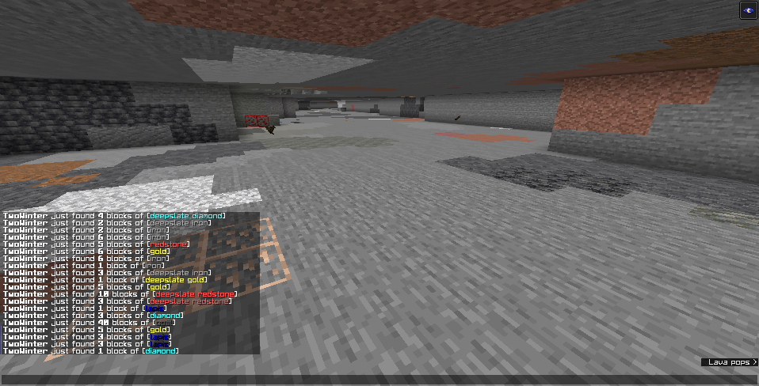

# MineBroadcast

A fork of [OreBroadcast](https://github.com/bendem/OreBroadcast).

## Description

Allows server staff to receive messages when certain blocks are broken. These messages are also logged to console.

## Commands

- `/mb reload`: Reload config from file
- `/mb optout`: Stop receiving MineBroadcast messages
- `/mb optin`: Receive MineBroadcast messages

## Permissions

- `mb.receive`: Receive MineBroadcast messages
- `mb.broadcast`: Send MineBroadcast messages
- `mb.commands.optout`: Required to use optout command
- `mb.commands.optin`: Required to use optin command
- `mb.commands.reload`: Required to use the reload command

